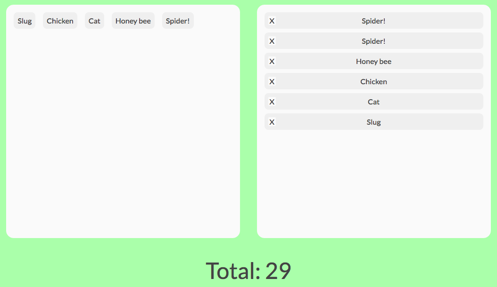

# Drag-n-drop-totaliser

## What?
Add up abitrary amounts using drag and drop UI. Built with [Dragula](https://github.com/bevacqua/dragula) and [Redux](https://github.com/reactjs/redux)

## Why?
Add up the total number of legs of animals in a list. Estimate the cost of a job given a list of services required. Drag items from a restaurant menu, get the total bill.

## API
Drag-n-drop-totaliser is built with [Redux](https://github.com/reactjs/redux). Its API exposes the app's `state` and `store` objects. Functions can subscribe to state changes using the `totaliser.subscribe()` method.